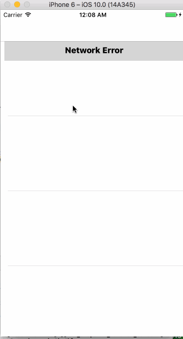

# Flicks

This is the Flicks movie project.

Time spent: 12 hours spent in total

Completed user stories:

 * [x] Required: User can view a list of movies currently playing in theaters from The Movie Database. Poster images must be loaded asynchronously.
 * [x] Required: User can view movie details by tapping on a cell.
 * [x] Required: User sees loading state while waiting for movies API.
 * [x] Required: User sees an error message when there's a networking error.
 * [x] Required: User can pull to refresh the movie list.
 
Notes:

Optional features not completed as focus is on completing all required assignments to catch up.

Walkthrough of all user stories:

Walkthrough starts with Wifi turned off to display network error. Then Wifi is turned on to show loading and traversal of app.

GIF created with [LiceCap](http://www.cockos.com/licecap/).
